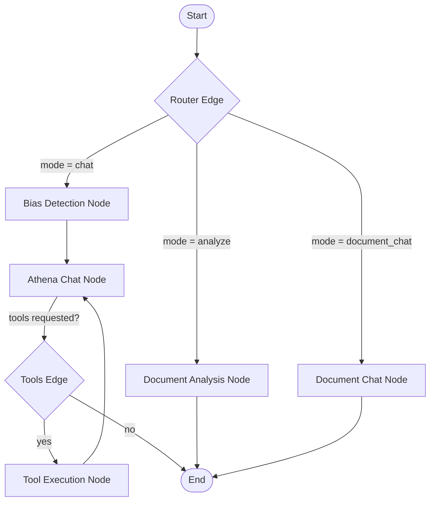

# Athena AI

Athena AI is a full-stack, production-grade application designed for:
- **Unbiased Conversational Reasoning**: A chat assistant that spots unfairness, prejudice, and demographic bias in user prompts and guides users toward fairer decision-making.
- **Document Bias Analysis**: Parses spreadsheet (`.csv`, `.tsv`, `.xlsx`) and text-based documents to analyze them for gender, age, racial, religious, disability, or other demographic biases.
- **Document-Grounded Chat**: Engages in follow-up conversations grounded strictly in the context of the uploaded document and initial analysis.

---

## 🏗️ Refactored Architecture: LangGraph & LangChain

The backend has been refactored from a linear API request handler to a stateful, graph-based architecture powered by **LangGraph** (for workflow orchestration) and **LangChain** (as the LLM abstraction layer), ensuring typed state management, reusable chains, tool integration, and future scalability for multi-agent workflows.



### 🧠 Graph Components & Nodes

1. **State Management (`AthenaState`)**:
   Managed via a structured `TypedDict` containing the conversation history (list of LangChain message classes), session metadata (`user_id`, `conversation_id`), `document_context` (filename, content, initial analysis), and final response/error containers.
   
2. **Entry Router (`route_mode`)**:
   A state-based conditional edge inspects the execution payload parameters to immediately route the workflow to the correct functional branch: general chat, document analysis, or document chat.
   
3. **Bias Detection Node**:
   Executes a hybrid check:
   - *Heuristics*: A fast keyword search targeting demographic triggers (e.g., gender, race, religion) paired with selection actions.
   - *LLM Validation*: A lightweight model chain running with temperature `0` to catch subtle demographic biases and flag them.
   
4. **Athena Chat Node**:
   Runs the conversational assistant with temperature `0.7` to ensure warmth and personality. This node is bound to standard tools, supporting a **ReAct loop** where the LLM can dynamically call resources.
   
5. **Document Analysis Node**:
   Directly parses and formats full-text extracts, invoking a specialized template to highlight biases, quote exact lines, and suggest neutral rewrites.
   
6. **Document Chat Node**:
   Provides a grounded chat interface, using context boundaries to answer queries strictly based on the uploaded file's contents.

---

## 🛠️ Tools Integration

Athena is equipped with reusable tools that are bound to the Gemini model and can be executed dynamically during conversation:
- `get_bias_definitions`: Retrieves industry-standard compliance guidelines (e.g., EEOC guidelines, gender-neutral hiring practices, ageism avoidance).
- `get_common_biased_phrases`: Returns a mapping of common biased terms in business documents and their recommended neutral alternatives.

---

## 📂 Project Structure

```text
Athena-AI/
├── api/                             # Backend API & Graph logic
│   ├── graph/                       # LangGraph orchestration engine
│   │   ├── nodes/                   # Task-specific workflow nodes
│   │   │   ├── athena_chat.py       # General chat & tool execution node
│   │   │   ├── bias_detection.py    # Hybrid bias verification node
│   │   │   ├── document_analysis.py # Document bias analysis node
│   │   │   └── document_chat.py     # Grounded document chat node
│   │   ├── prompts.py               # Structured LLM prompt templates
│   │   ├── state.py                 # Typed state definitions (AthenaState)
│   │   ├── tools.py                 # Bound LangChain tools for agent use
│   │   └── workflow.py              # Compilation of StateGraph routes
│   ├── services/                    # Business services layer
│   │   └── athena_service.py        # Orchestrates graph invocations & API schemas
│   ├── _auth.py                     # Firebase Admin auth token validation
│   ├── _firebase.py                 # Firestore DB configuration
│   ├── _gemini.py                   # Legacy service bridge to LangGraph wrapper
│   ├── chat.py                      # Vercel Serverless chat function
│   ├── upload.py                    # Vercel Serverless document upload function
│   ├── main.py                      # Local development FastAPI app
│   └── requirements.txt             # Python packages (FastAPI, LangGraph, etc.)
├── frontend/                        # React + Tailwind SPA
│   ├── src/components/              # UI components (Sidebar, Chat, Upload)
│   ├── src/contexts/                # React Auth context (Firebase Integration)
│   ├── src/pages/                   # Auth & Dashboard pages
│   └── package.json
└── vercel.json                      # Vercel Routing & Serverless build config
```

---

## ⚙️ Environment Variables

Set up local environment files to connect backend models and Firebase authentication.

### Backend (`api/`)
Create an `.env` file in the `api/` directory:
```env
GEMINI_API_KEY=your_gemini_api_key

# Firebase Configuration
FIREBASE_PROJECT_ID=your_firebase_project_id
FIREBASE_PRIVATE_KEY_ID=your_firebase_private_key_id
FIREBASE_PRIVATE_KEY="your_firebase_private_key" # Keep the \n formatting intact
FIREBASE_CLIENT_EMAIL=your_firebase_client_email
FIREBASE_CLIENT_ID=your_firebase_client_id
FIREBASE_STORAGE_BUCKET=your_firebase_storage_bucket.appspot.com
```

### Frontend (`frontend/`)
Create an `.env` file in the `frontend/` directory:
```env
REACT_APP_BACKEND_URL=http://localhost:8000
REACT_APP_FIREBASE_API_KEY=your_client_api_key
REACT_APP_FIREBASE_AUTH_DOMAIN=your_project.firebaseapp.com
REACT_APP_FIREBASE_PROJECT_ID=your_project_id
REACT_APP_FIREBASE_STORAGE_BUCKET=your_project.firebasestorage.app
REACT_APP_FIREBASE_MESSAGING_SENDER_ID=your_sender_id
REACT_APP_FIREBASE_APP_ID=your_app_id
```

---

## 🚀 Local Development

### 1. Backend Setup (FastAPI)
Navigate to the `api` folder, setup a virtual environment, install requirements, and run the FastAPI server:
```bash
cd api
python -m venv .venv
source .venv/bin/activate       # On Windows use: .venv\Scripts\activate
pip install -r requirements.txt
uvicorn main:app --reload --host 0.0.0.0 --port 8000
```
Verify the API is running by executing:
```bash
curl http://localhost:8000/api/health
```

### 2. Frontend Setup (React)
Open a new terminal window, navigate to the `frontend` folder, install JavaScript packages, and start the development server:
```bash
cd frontend
npm install
npm start
```
The React development application runs at `http://localhost:3000` and proxies backend calls to `http://localhost:8000`.

---

## ☁️ Deployment

This project is configured for serverless deployment on **Vercel**:
- Frontend build utilizes CRACO and Tailwind to output optimized static HTML/JS.
- Backend Python serverless routes are mapped via `vercel.json` dynamically mapping backend files under `api/*.py`.
- Ensure all environment variables listed above are configured in your Vercel project settings dashboard.
